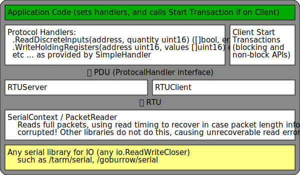

# ModbusOne [](https://godoc.org/github.com/xiegeo/modbusone)
A Modbus library for Go, with unified client and server APIs.
One implementation to rule them all.
<details>
  <summary>Example</summary>

[embedmd]:# (examples_test.go /\/\/ handlerGenerator/ /end readme example/)
```go
// handlerGenerator returns ProtocolHandlers that interact with our application.
// In this example, we are only using Holding Registers.
func handlerGenerator(name string) modbusone.ProtocolHandler {
    return &modbusone.SimpleHandler{
        ReadHoldingRegisters: func(address, quantity uint16) ([]uint16, error) {
            fmt.Printf("%v ReadHoldingRegisters from %v, quantity %v\n",
                name, address, quantity)
            r := make([]uint16, quantity)
            // application code that fills in r here
            return r, nil
        },
        WriteHoldingRegisters: func(address uint16, values []uint16) error {
            fmt.Printf("%v WriteHoldingRegisters from %v, quantity %v\n",
                name, address, len(values))
            // application code here
            return nil
        },
        OnErrorImp: func(req modbusone.PDU, errRep modbusone.PDU) {
            fmt.Printf("%v received error:%x in request:%x", name, errRep, req)
        },
    }
}

// serial is a fake serial port
type serial struct {
    io.ReadCloser
    io.WriteCloser
}

func newInternalSerial() (io.ReadWriteCloser, io.ReadWriteCloser) {
    r1, w1 := io.Pipe()
    r2, w2 := io.Pipe()
    return &serial{ReadCloser: r1, WriteCloser: w2}, &serial{ReadCloser: r2, WriteCloser: w1}
}

func (s *serial) Close() error {
    s.ReadCloser.Close()
    return s.WriteCloser.Close()
}

func Example_serialPort() {
    // Server id and baudRate, for Modbus over serial port.
    id := byte(1)
    baudRate := int64(19200)

    // Open serial connections:
    clientSerial, serverSerial := newInternalSerial()
    // Normally we want to open a serial connection from serial.OpenPort
    // such as github.com/tarm/serial. modbusone can take any io.ReadWriteCloser,
    // so we created two that talks to each other for demonstration here.

    // SerialContext adds baudRate information to calculate
    // the duration that data transfers should takes.
    // It also records Stats of read and dropped packets.
    clientSerialContext := modbusone.NewSerialContext(clientSerial, baudRate)
    serverSerialContext := modbusone.NewSerialContext(serverSerial, baudRate)

    // You can create either a client or a server from a SerialContext and an id.
    client := modbusone.NewRTUClient(clientSerialContext, id)
    server := modbusone.NewRTUServer(serverSerialContext, id)

    useClientAndServer(client, server, id) // follow the next function

    // Output:
    // reqs count: 2
    // reqs count: 3
    // server ReadHoldingRegisters from 0, quantity 125
    // client WriteHoldingRegisters from 0, quantity 125
    // server ReadHoldingRegisters from 125, quantity 75
    // client WriteHoldingRegisters from 125, quantity 75
    // client ReadHoldingRegisters from 1000, quantity 100
    // server WriteHoldingRegisters from 1000, quantity 100
    // server ReadHoldingRegisters from 0, quantity 125
    // client WriteHoldingRegisters from 0, quantity 125
    // server ReadHoldingRegisters from 125, quantity 75
    // client WriteHoldingRegisters from 125, quantity 75
    // client ReadHoldingRegisters from 1000, quantity 100
    // server WriteHoldingRegisters from 1000, quantity 100
    // serve terminated: io: read/write on closed pipe
}

func useClientAndServer(client modbusone.Client, server modbusone.ServerCloser, id byte) {
    termChan := make(chan error)

    // Serve is blocking until the serial connection has io errors or is closed.
    // So we use a goroutine to start it and continue setting up our demo.
    go client.Serve(handlerGenerator("client"))
    go func() {
        // A server is Started to same way as a client
        err := server.Serve(handlerGenerator("server"))
        // Do something with the err here.
        // For a command line app, you probably want to terminate.
        // For a service, you probably want to wait until you can open the serial port again.
        termChan <- err
    }()
    defer client.Close()
    defer server.Close()

    // If you only need to support server side, then you are done.
    // If you need to support client side, then you need to make requests.
    clientDoTransactions(client, id) // see following function

    // Clean up
    server.Close()
    fmt.Println("serve terminated:", <-termChan)
}

func clientDoTransactions(client modbusone.Client, id byte) {
    // start by building some requests
    startAddress := uint16(0)
    quantity := uint16(200)
    reqs, err := modbusone.MakePDURequestHeaders(modbusone.FcReadHoldingRegisters,
        startAddress, quantity, nil)
    if err != nil {
        fmt.Println(err) // if what you asked for is not possible.
    }
    // Larger than allowed requests are split to many packets.
    fmt.Println("reqs count:", len(reqs))

    // We can add more requests, even of different types.
    // The last nil is replaced by the reqs to append to.
    startAddress = uint16(1000)
    quantity = uint16(100)
    reqs, err = modbusone.MakePDURequestHeaders(modbusone.FcWriteMultipleRegisters,
        startAddress, quantity, reqs)
    if err != nil {
        fmt.Println(err)
    }
    fmt.Println("reqs count:", len(reqs))

    // Range over the requests to handle each individually,
    for _, r := range reqs {
        err = client.DoTransaction(r)
        if err != nil {
            fmt.Println(err, "on", r) // The server timed out, or the connection was closed.
        }
    }
    // or just do them all at once. Notice that reqs can be reused.
    n, err := modbusone.DoTransactions(client, id, reqs)
    if err != nil {
        fmt.Println(err, "on", reqs[n])
    }
}

func Example_tcp() {
    // TCP address of the host
    host := "127.2.9.1:12345"

    // Default server id
    id := byte(1)

    // Open server tcp listener:
    listener, err := net.Listen("tcp", host)
    if err != nil {
        fmt.Println(err)
        return
    }

    // Connect to server:
    conn, err := net.Dial("tcp", host)
    if err != nil {
        fmt.Println(err)
        return
    }

    // You can create either a client or a server
    client := modbusone.NewTCPClient(conn, 0)
    server := modbusone.NewTCPServer(listener)

    // shared example code with serial port
    useClientAndServer(client, server, id)

    // Output:
    // reqs count: 2
    // reqs count: 3
    // server ReadHoldingRegisters from 0, quantity 125
    // client WriteHoldingRegisters from 0, quantity 125
    // server ReadHoldingRegisters from 125, quantity 75
    // client WriteHoldingRegisters from 125, quantity 75
    // client ReadHoldingRegisters from 1000, quantity 100
    // server WriteHoldingRegisters from 1000, quantity 100
    // server ReadHoldingRegisters from 0, quantity 125
    // client WriteHoldingRegisters from 0, quantity 125
    // server ReadHoldingRegisters from 125, quantity 75
    // client WriteHoldingRegisters from 125, quantity 75
    // client ReadHoldingRegisters from 1000, quantity 100
    // server WriteHoldingRegisters from 1000, quantity 100
    // serve terminated: accept tcp 127.2.9.1:12345: use of closed network connection
}

// end readme example
```

</details>
For more usage examples, see examples/memory, which is a command line application that can be used as either a server or a client.

## Architecture



## Why

There exist Modbus libraries for Go, such as goburrow/modbus and flosse/go-modbus.
However they do not include any server APIs. Even if server function is implemented, user code will have to be written separately to support running both as client and server.

In my use case, client/server should be interchangeable. User code should worry about how to handle the translation of MODBUS data model to application logic. The only difference is the client also initiate requests.

This means that a remote function call like API, which is effective as a client-side API, is insufficient.

Instead, a callback based API (like http server handler) is used for both server and client.

## Implemented

- Serial RTU
- Modbus over TCP
- Function Codes 1-6,15,16
- Server and Client API
- Server and Client Tester (examples/memory)

## Development

This project and API is stable, and I am using it in production.

My primary usage is RTU (over RS-485). TCP is also supported. Others may or may not be implemented in the future.

Contribution to new or existing functionally, or just changing a private identifier public are welcome, as well as documentation, test, example code or any other improvements.

Development tools:

- `go generate` runs `embedmd` to copy parts of the examples_test.go to this readme file
- `golangci-lint run` for improvement hints. Ideally there are no warnings.
- Use `go test -race -count=5 ./...` pre release.

## Breaking Changes

2018-09-27 v0.2.0

- NewRTUPacketReader returns PacketReader interface instead of io.Reader. When a new RTU server or client receives a SerialContext, it will test if it is also a PacketReader, and only create a new NewRTUPacketReader if not.
- (client/server).Serve() now also closes themselves when returned. This avoids some potentially bad usages. Before, the behavior was undefined.

2017-06-13 pre-v0.1.0

- Removed dependency on goburrow/serial. All serial connections should be created with NewSerialContext, which can accept any ReadWriteCloser

## Challenges

Compatibility with a wide range of serial hardware/drivers. (good)

Compatibility with existing Modbus environments, including non-compliance and extensions. (good)

Recover from transmission errors and timeouts, to work continuously unattended. (good)

Better test coverage that also tests error conditions. (todo)

Fuzz testing. (todo)

## Failover mode

TLDR: do not use.

Failover has landed in v0.2.0, but it should be considered less stable than the other parts.

In mission-critical applications, or anywhere hardware redundancy is cheaper than downtime, having a standby system taking over in case of the failure of the primary system is desirable.

Ideally, failover is implemented in the application level, which speaks over two serial ports simultaneously, only acting on the values from one of the ports at a time. However, this may not always be possible. A "foreign" application, which you have no control over, might not have this feature. As such, failover mode attempts to addresses this by allowing two separate hardware devices sharing a single serial bus to appear as a single device. This failover mode is outside the design of the original Modbus protocol.

The basic operation of failover mode is to stay quiet on the port until the primary fails. While staying quiet, it relays all reads and writes to the application side as if it is the primary. This allows the application to stay in sync for a hot switch over when the primary fails. While on standby and in Client (Master) mode, writes may be received by the handler that is not initiated by that Client.

## Definitions

<dl>
<dt>Client/Server
  <dd>Also called Master/Slave in the context of serial communication.
<dt>PDU
  <dd>Protocol data unit, MODBUS application protocol, include function code and data. The same format no matter what the lower level protocol is.
<dt>ADU
  <dd>Application data unit, PDU prepended with Server addresses and postpended with error check, as needed.
<dt>RTU
  <dd>Remote terminal unit, in the context of Modbus, it is a raw wire protocol delimited by a delay. RTU is an example of ADU.
</dl>

## License

This library is distributed under the BSD-style license found in the LICENSE file.

See also licenses folder for origins of large blocks of source code.
